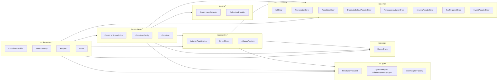

# Opinionated Python IoC Proposal (Python 3.14 idioms) 🧩

Generated: `2026-01-29 10:23:29Z`

This rewrite follows your rules:

- **One class per file**, except `errors.py` and `types.py`
- `types.py` contains only **type aliases** and **immutable dataclasses**
- Empty implementations use `pass` (no `NotImplementedError`)
- Docstrings follow **PEP 257** style and use **reStructuredText** conventions
- Uses **Python 3.14-friendly idioms** (e.g., `type` aliases, `typing.override`)

---

## Package layout

```text
ioc/
  __init__.py
  errors.py
  types.py
  scope.py

  env/
    __init__.py
    environment_provider.py
    os_environ_provider.py

  registry/
    __init__.py
    adapter_registration.py
    keyed_entry.py
    adapter_registry.py

  container/
    __init__.py
    container_scope_policy.py
    container_config.py
    container.py

  decorators/
    __init__.py
    container_provider.py
    invert_key_map.py
    adapter.py
    invert.py
```

---

## Mermaid module + class dependency diagram



---

# Source skeletons (one class per file)

## `ioc/__init__.py`

```python
\"\"\"Top-level package for the opinionated IoC library.\"\"\"

from .errors import IoCError
from .scope import ScopeEnum
from .types import ResolutionRequest

__all__ = [
    "IoCError",
    "ScopeEnum",
    "ResolutionRequest",
]
```

---

## `ioc/errors.py`

```python
\"\"\"Exception types for the IoC library.\"\"\"

from __future__ import annotations


class IoCError(Exception):
    \"\"\"Base class for all IoC-related errors.\"\"\"

    pass


class RegistrationError(IoCError):
    \"\"\"Raised when adapter registration fails.\"\"\"

    pass


class ResolutionError(IoCError):
    \"\"\"Raised when dependency resolution fails.\"\"\"

    pass


class DuplicateDefaultAdapterError(RegistrationError):
    \"\"\"Raised when more than one default Adapter is registered for a Port.\"\"\"

    def __init__(self, port: type[object]) -> None:
        \"\"\"Initialize the error.

        :param port: The Port type for which duplicates were detected.
        \"\"\"
        super().__init__(f"Multiple default adapters registered for port: {port!r}")


class AmbiguousAdapterError(ResolutionError):
    \"\"\"Raised when adapter selection cannot produce a unique winner.\"\"\"

    def __init__(self, port: type[object], env: str | None) -> None:
        \"\"\"Initialize the error.

        :param port: The Port being resolved.
        :param env: The current environment name, if any.
        \"\"\"
        super().__init__(f"Ambiguous adapters for port {port!r} (env={env!r}).")


class MissingAdapterError(ResolutionError):
    \"\"\"Raised when no Adapter is registered for a required Port.\"\"\"

    def __init__(self, port: type[object], env: str | None) -> None:
        \"\"\"Initialize the error.

        :param port: The Port being resolved.
        :param env: The current environment name, if any.
        \"\"\"
        super().__init__(f"No adapter registered for port {port!r} (env={env!r}).")


class KeyRequiredError(ResolutionError):
    \"\"\"Raised when resolving a keyed adapter without providing a key.\"\"\"

    def __init__(self, port: type[object]) -> None:
        \"\"\"Initialize the error.

        :param port: The Port being resolved.
        \"\"\"
        super().__init__(f"Key required to resolve keyed adapter for port {port!r}.")


class InvalidAdapterError(RegistrationError):
    \"\"\"Raised when an Adapter class is invalid for a Port.\"\"\"

    def __init__(self, port: type[object], adapter: type[object], reason: str) -> None:
        \"\"\"Initialize the error.

        :param port: The Port type.
        :param adapter: The Adapter type.
        :param reason: Human-readable reason.
        \"\"\"
        super().__init__(f"Invalid adapter {adapter!r} for port {port!r}: {reason}")
```

---

## `ioc/types.py`

```python
\"\"\"Core type definitions for the IoC library.\"\"\"

from __future__ import annotations

from dataclasses import dataclass
from typing import Any, Callable

type PortType = type[object]
type AdapterType = type[object]
type KeyType = str


@dataclass(frozen=True, slots=True)
class ResolutionRequest:
    \"\"\"Normalized request for resolving a Port.

    :param port: The Port type to resolve.
    :param env: The environment name in effect, if any.
    :param key: Optional key for keyed resolution.
    \"\"\"

    port: PortType
    env: str | None
    key: KeyType | None


type AdapterFactory = Callable[[\"Container\"], Any]


class Container:
    \"\"\"Forward declaration for type checkers.

    The concrete container lives in :mod:`ioc.container.container`.
    \"\"\"

    pass
```

---

## `ioc/scope.py`

```python
\"\"\"Scope definitions for adapters.\"\"\"

from __future__ import annotations

from enum import Enum


class ScopeEnum(str, Enum):
    \"\"\"Lifecycle scopes for Adapters.

    - ``SINGLETON``: One instance reused.
    - ``UNIQUE``: A new instance per resolution.
    - ``KEYED``: One instance per ``(Port, key)``.
    \"\"\"

    SINGLETON = "Singleton"
    UNIQUE = "Unique"
    KEYED = "Keyed"
```

---

# env package

## `ioc/env/__init__.py`

```python
\"\"\"Environment resolution abstractions.\"\"\"

from .environment_provider import EnvironmentProvider
from .os_environ_provider import OsEnvironProvider

__all__ = ["EnvironmentProvider", "OsEnvironProvider"]
```

## `ioc/env/environment_provider.py`

```python
\"\"\"Environment provider abstraction.\"\"\"

from __future__ import annotations

from abc import ABC, abstractmethod


class EnvironmentProvider(ABC):
    \"\"\"Abstraction for retrieving the active environment name.\"\"\"

    @abstractmethod
    def get_env(self) -> str | None:
        \"\"\"Return the current environment name.

        :returns: Environment name such as ``"dev"`` or ``"prod"``, or ``None``.
        \"\"\"
        pass
```

## `ioc/env/os_environ_provider.py`

```python
\"\"\"OS environment-backed environment provider.\"\"\"

from __future__ import annotations

from dataclasses import dataclass


@dataclass(frozen=True, slots=True)
class OsEnvironProvider:
    \"\"\"Reads environment from an OS env var.

    :param env_var: The OS environment variable name to read.
    \"\"\"

    env_var: str = "PYTHON_ENV"

    def get_env(self) -> str | None:
        \"\"\"Return environment name from the configured OS env var.

        :returns: Environment string or ``None``.
        \"\"\"
        pass
```

---

# registry package

## `ioc/registry/__init__.py`

```python
\"\"\"Adapter registration and lookup.\"\"\"

from .adapter_registration import AdapterRegistration
from .keyed_entry import KeyedEntry
from .adapter_registry import AdapterRegistry

__all__ = ["AdapterRegistration", "KeyedEntry", "AdapterRegistry"]
```

## `ioc/registry/adapter_registration.py`

```python
\"\"\"Registration metadata for a Port/Adapter pairing.\"\"\"

from __future__ import annotations

from dataclasses import dataclass

from ..scope import ScopeEnum
from ..types import AdapterType, KeyType, PortType


@dataclass(frozen=True, slots=True)
class AdapterRegistration:
    \"\"\"Metadata describing a registered Adapter implementation for a Port.

    :param port: The Port this Adapter satisfies.
    :param adapter: The Adapter concrete class.
    :param scope: Lifecycle scope for the Adapter.
    :param default: Whether this Adapter is the default choice for the Port.
    :param env: Optional environment name. If it matches, it wins selection.
    :param env_var: Name of env var consulted to determine current environment.
    :param key: Required if scope is keyed; identifies keyed instance bucket.
    :param invalidate: If True, keyed instances may expire after inactivity timeout.
    \"\"\"

    port: PortType
    adapter: AdapterType
    scope: ScopeEnum
    default: bool
    env: str | None
    env_var: str
    key: KeyType | None
    invalidate: bool
```

## `ioc/registry/keyed_entry.py`

```python
\"\"\"Keyed instance cache entry.\"\"\"

from __future__ import annotations

from dataclasses import dataclass
from typing import Any


@dataclass(slots=True)
class KeyedEntry:
    \"\"\"An entry in the keyed instance cache.

    :param instance: The cached Adapter instance.
    :param last_used_epoch: Seconds since epoch when instance was last accessed.
    :param invalidate: Whether this entry can expire.
    \"\"\"

    instance: Any
    last_used_epoch: float
    invalidate: bool

    def touch(self) -> None:
        \"\"\"Update the last-used timestamp to now.\"\"\"
        pass
```

## `ioc/registry/adapter_registry.py`

```python
\"\"\"Central registry of Port -> Adapter registrations and keyed instance cache.\"\"\"

from __future__ import annotations

from threading import RLock

from ..errors import (
    AmbiguousAdapterError,
    DuplicateDefaultAdapterError,
    InvalidAdapterError,
    MissingAdapterError,
)
from ..types import KeyType, PortType, ResolutionRequest
from .adapter_registration import AdapterRegistration
from .keyed_entry import KeyedEntry


class AdapterRegistry:
    \"\"\"Stores registrations and keyed instances.

    Responsibilities:
    - Accept registrations declared by :class:`ioc.decorators.adapter.Adapter`
    - Enforce uniqueness of default per Port
    - Select the best adapter by env/default rules
    - Cache keyed instances and optionally prune expired entries
    \"\"\"

    def __init__(self, keyed_idle_ttl_seconds: int = 600) -> None:
        \"\"\"Initialize the registry.

        :param keyed_idle_ttl_seconds: Default idle timeout for invalidatable keyed entries.
        \"\"\"
        self._lock: RLock = RLock()
        self._keyed_idle_ttl_seconds: int = keyed_idle_ttl_seconds
        self._registrations: dict[PortType, list[AdapterRegistration]] = {}
        self._keyed_instances: dict[tuple[PortType, KeyType], KeyedEntry] = {}

    def register(self, reg: AdapterRegistration) -> None:
        \"\"\"Register an Adapter for a Port.

        :param reg: Registration metadata to add.
        :raises DuplicateDefaultAdapterError: If a second default is registered for the Port.
        :raises InvalidAdapterError: If the Adapter is invalid for the Port.
        \"\"\"
        pass

    def list_ports(self) -> list[PortType]:
        \"\"\"Return all Ports with registrations.

        :returns: List of Port types.
        \"\"\"
        pass

    def get_registrations(self, port: PortType) -> list[AdapterRegistration]:
        \"\"\"Return registrations for a Port.

        :param port: The Port type.
        :returns: Registrations for the Port (possibly empty).
        \"\"\"
        pass

    def select(self, request: ResolutionRequest) -> AdapterRegistration:
        \"\"\"Select the best AdapterRegistration for the resolution request.

        Selection rules:
        1. env match wins
        2. default wins
        3. single candidate wins
        else ambiguous

        :param request: Normalized request.
        :returns: Selected registration.
        :raises MissingAdapterError: If no candidates exist.
        :raises AmbiguousAdapterError: If no unique winner exists.
        \"\"\"
        pass

    def get_keyed_entry(self, port: PortType, key: KeyType) -> KeyedEntry | None:
        \"\"\"Retrieve a keyed cache entry if present.

        :param port: The Port type.
        :param key: The instance key.
        :returns: The cache entry or ``None``.
        \"\"\"
        pass

    def set_keyed_entry(self, port: PortType, key: KeyType, entry: KeyedEntry) -> None:
        \"\"\"Store a keyed cache entry.

        :param port: The Port type.
        :param key: The instance key.
        :param entry: The cache entry.
        \"\"\"
        pass

    def prune_keyed(self, now_epoch: float | None = None) -> int:
        \"\"\"Remove expired keyed entries.

        An entry is expired if:
        - ``entry.invalidate`` is True
        - and ``(now - entry.last_used_epoch) >= ttl``

        :param now_epoch: Override current time for deterministic tests.
        :returns: Number of entries removed.
        \"\"\"
        pass

    def keyed_idle_ttl_seconds(self) -> int:
        \"\"\"Return the current TTL for invalidatable keyed entries.

        :returns: TTL in seconds.
        \"\"\"
        pass
```

---

# container package

## `ioc/container/__init__.py`

```python
\"\"\"Container and resolution policy.\"\"\"

from .container_scope_policy import ContainerScopePolicy
from .container_config import ContainerConfig
from .container import Container

__all__ = ["ContainerScopePolicy", "ContainerConfig", "Container"]
```

## `ioc/container/container_scope_policy.py`

```python
\"\"\"Singleton scoping policy.\"\"\"

from __future__ import annotations

from enum import Enum


class ContainerScopePolicy(str, Enum):
    \"\"\"Controls where singleton instances live.

    - ``PER_CONTAINER``: Singleton cache is per Container instance.
    - ``GLOBAL``: Singleton cache is shared (less test-friendly).
    \"\"\"

    PER_CONTAINER = "PerContainer"
    GLOBAL = "Global"
```

## `ioc/container/container_config.py`

```python
\"\"\"Container configuration.\"\"\"

from __future__ import annotations

from dataclasses import dataclass

from ..env.environment_provider import EnvironmentProvider
from ..env.os_environ_provider import OsEnvironProvider
from ..registry.adapter_registry import AdapterRegistry
from .container_scope_policy import ContainerScopePolicy


@dataclass(slots=True)
class ContainerConfig:
    \"\"\"Configuration for the Container.

    :param registry: Adapter registry holding registrations and caches.
    :param env_provider: Provider for current environment string.
    :param scope_policy: Policy controlling singleton cache behavior.
    \"\"\"

    registry: AdapterRegistry
    env_provider: EnvironmentProvider = OsEnvironProvider()  # type: ignore[assignment]
    scope_policy: ContainerScopePolicy = ContainerScopePolicy.PER_CONTAINER
```

## `ioc/container/container.py`

```python
\"\"\"Constructor-only dependency resolver.\"\"\"

from __future__ import annotations

from typing import Any, TypeVar

from ..errors import AmbiguousAdapterError, KeyRequiredError, MissingAdapterError
from ..types import KeyType, PortType
from .container_config import ContainerConfig

T = TypeVar("T")


class Container:
    \"\"\"Resolver that builds object graphs using constructor injection.

    Rules:
    - Constructor-only injection (via :class:`ioc.decorators.invert.Invert`)
    - Port types are determined from ``__init__`` annotations
    - Adapter selection uses env/default rules from :class:`ioc.registry.adapter_registry.AdapterRegistry`
    - Adapter lifecycle is enforced via :class:`ioc.scope.ScopeEnum`

    This is intentionally opinionated:
    - Un-annotated parameters are not injected.
    - Explicit caller-provided args always win over injection.
    \"\"\"

    def __init__(self, config: ContainerConfig) -> None:
        \"\"\"Initialize the container.

        :param config: Container configuration.
        \"\"\"
        self._config: ContainerConfig = config
        self._singletons: dict[PortType, Any] = {}

    def env(self) -> str | None:
        \"\"\"Return the current environment name.

        :returns: Environment name or ``None``.
        \"\"\"
        pass

    def resolve(self, port: PortType, *, key: KeyType | None = None) -> Any:
        \"\"\"Resolve an instance for a Port.

        :param port: The Port type to resolve.
        :param key: Optional key for keyed scope.
        :returns: Instance implementing the Port.
        :raises MissingAdapterError: If no adapter exists.
        :raises AmbiguousAdapterError: If multiple candidates exist with no winner.
        :raises KeyRequiredError: If the chosen scope is keyed but no key was provided.
        \"\"\"
        pass

    def create(self, cls: type[T], **overrides: Any) -> T:
        \"\"\"Create an instance of ``cls``, injecting constructor dependencies.

        Overrides:
        - Any keyword args in ``overrides`` are used as-is and are not injected.

        :param cls: Concrete class to instantiate.
        :param overrides: Explicit constructor arguments.
        :returns: New instance of ``cls``.
        \"\"\"
        pass
```

---

# decorators package

## `ioc/decorators/__init__.py`

```python
\"\"\"Decorators that power registration and constructor injection.\"\"\"

from .container_provider import ContainerProvider
from .invert_key_map import InvertKeyMap
from .adapter import Adapter
from .invert import Invert

__all__ = ["ContainerProvider", "InvertKeyMap", "Adapter", "Invert"]
```

## `ioc/decorators/container_provider.py`

```python
\"\"\"Default container storage for decorator-driven injection.\"\"\"

from __future__ import annotations

from ..container.container import Container


class ContainerProvider:
    \"\"\"Stores and exposes a default Container for :class:`ioc.decorators.invert.Invert`.\"\"\"

    _container: Container | None = None

    @classmethod
    def set_default(cls, container: Container) -> None:
        \"\"\"Set the default container.

        :param container: Container to set.
        \"\"\"
        cls._container = container

    @classmethod
    def get_default(cls) -> Container:
        \"\"\"Return the default container.

        :returns: Default container.
        :raises RuntimeError: If no default container has been set.
        \"\"\"
        pass
```

## `ioc/decorators/invert_key_map.py`

```python
\"\"\"Key mapping for keyed constructor injection.\"\"\"

from __future__ import annotations

from dataclasses import dataclass

from ..types import KeyType


@dataclass(frozen=True, slots=True)
class InvertKeyMap:
    \"\"\"Maps constructor parameter names to keys for keyed resolution.

    Example::

        InvertKeyMap({"tenant_db": "tenant-123"})

    :param keys: Map from parameter name to key string.
    \"\"\"

    keys: dict[str, KeyType]
```

## `ioc/decorators/adapter.py`

```python
\"\"\"Class-based decorator used on Adapter classes to register them.\"\"\"

from __future__ import annotations

from typing import TypeVar, override

from ..registry.adapter_registry import AdapterRegistry
from ..scope import ScopeEnum

T = TypeVar("T")


class Adapter:
    \"\"\"Decorator that registers an Adapter implementation.

    Intended usage::

        @Adapter(scope=ScopeEnum.SINGLETON, default=True, env=None,
                env_var="PYTHON_ENV", key=None, invalidate=True)
        class SomeAdapter(SomePort):
            ...

    Port inference:
    - Prefer ``__ports__`` tuple on the Adapter class, if present.
    - Else infer from base classes that are ``typing.Protocol`` or named ``*Port``.

    Registration target:
    - Uses the configured :class:`~ioc.registry.adapter_registry.AdapterRegistry`.
    \"\"\"

    _registry: AdapterRegistry | None = None

    @classmethod
    def configure_registry(cls, registry: AdapterRegistry) -> None:
        \"\"\"Set the registry used by this decorator.

        :param registry: Registry to use for registration.
        \"\"\"
        cls._registry = registry

    def __init__(
        self,
        scope: ScopeEnum,
        *,
        default: bool = True,
        env: str | None = None,
        env_var: str = "PYTHON_ENV",
        key: str | None = None,
        invalidate: bool = True,
    ) -> None:
        \"\"\"Initialize the decorator.

        :param scope: Adapter scope (Singleton, Unique, Keyed).
        :param default: Whether this adapter is the default for its Port(s).
        :param env: Environment name that overrides default selection when matched.
        :param env_var: Environment variable used to determine current env.
        :param key: Key required if scope is Keyed.
        :param invalidate: If True, keyed entries may expire after inactivity timeout.
        \"\"\"
        self._scope = scope
        self._default = default
        self._env = env
        self._env_var = env_var
        self._key = key
        self._invalidate = invalidate

    def __call__(self, adapter_cls: type[T]) -> type[T]:
        \"\"\"Register the decorated Adapter class.

        :param adapter_cls: The concrete Adapter class.
        :returns: The same class, unmodified.
        \"\"\"
        pass
```

## `ioc/decorators/invert.py`

```python
\"\"\"Class-based decorator enabling constructor injection.\"\"\"

from __future__ import annotations

from typing import Any, Callable

from .container_provider import ContainerProvider
from .invert_key_map import InvertKeyMap


class Invert:
    \"\"\"Decorator for constructor-only dependency injection.

    Typical usage::

        class Service:
            @Invert()
            def __init__(self, repo: RepoPort, clock: ClockPort) -> None:
                ...

    Keyed injection::

        class MultiTenantThing:
            @Invert(keys=InvertKeyMap({"db": "tenant-123"}))
            def __init__(self, db: DatabasePort) -> None:
                ...

    Behavior:
    - Explicit caller-provided args win.
    - Missing annotated parameters are resolved from the default container.
    \"\"\"

    def __init__(self, *, keys: InvertKeyMap | None = None) -> None:
        \"\"\"Initialize the decorator.

        :param keys: Optional mapping to provide keyed resolution keys.
        \"\"\"
        self._keys = keys

    def __call__(self, init: Callable[..., Any]) -> Callable[..., Any]:
        \"\"\"Wrap ``__init__`` to inject missing annotated parameters.

        :param init: The original ``__init__`` method.
        :returns: Wrapped ``__init__`` method.
        \"\"\"
        pass
```

---

## Notes on Python 3.14 idioms used

- Type aliases use the `type Name = ...` syntax.
- Immutable dataclasses use `frozen=True` and `slots=True` where appropriate.
- Return types use modern unions (`str | None`) and keyword-only parameters (`*, key=...`) where useful.

